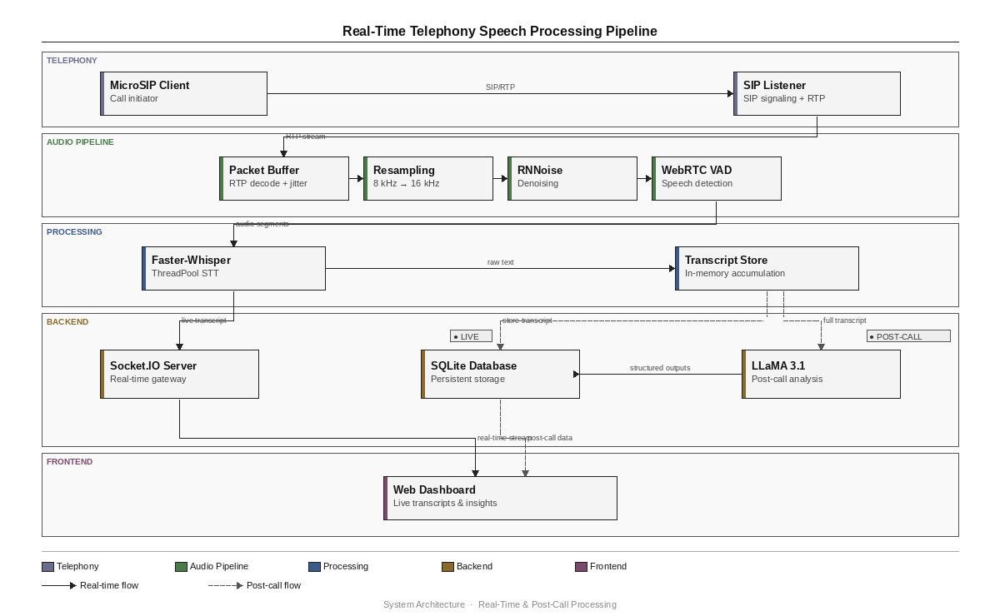
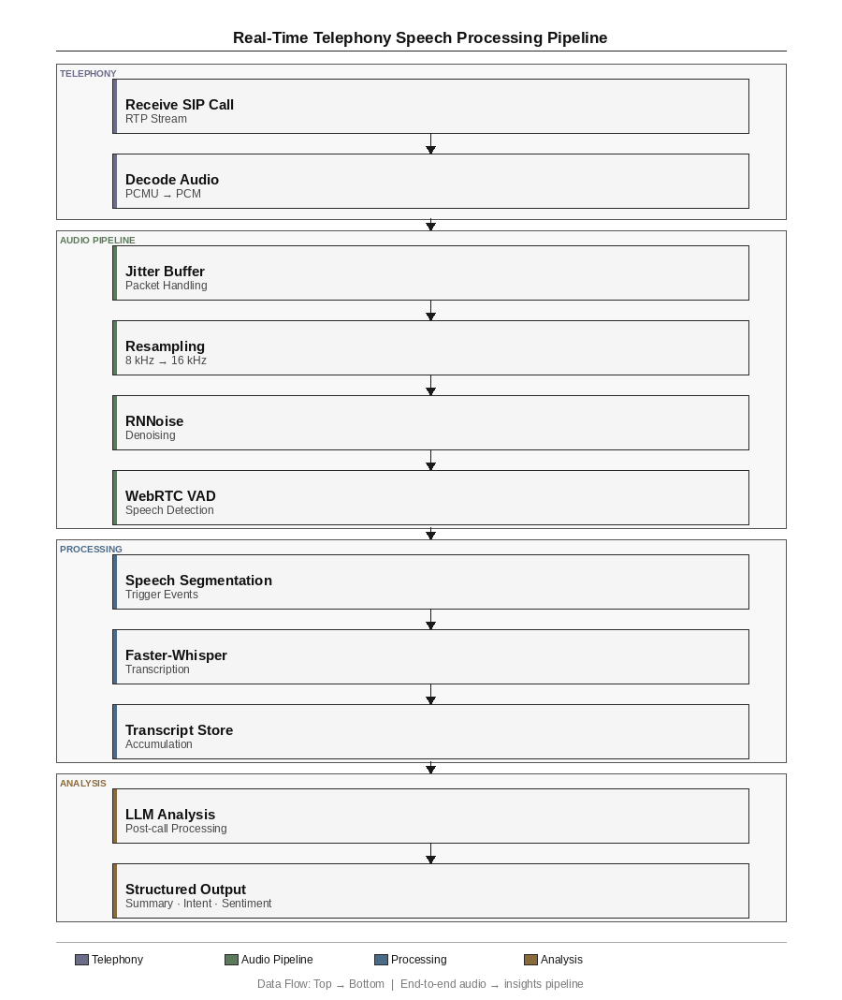
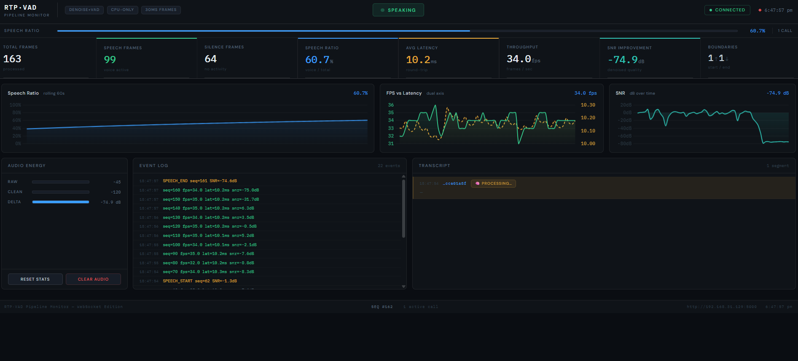
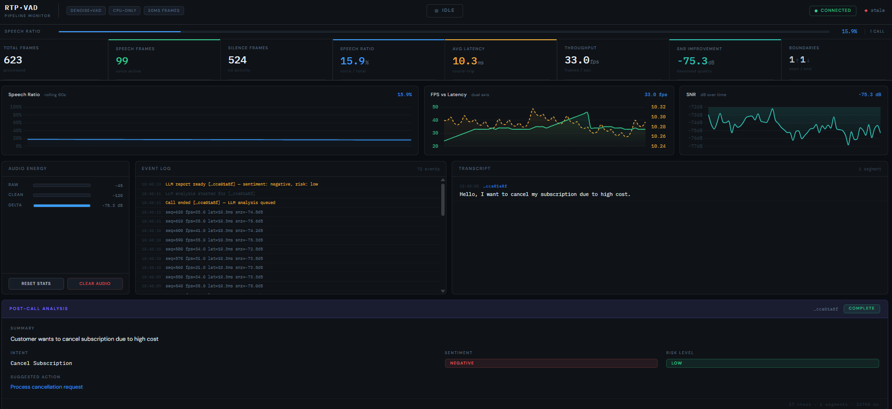

# 🎧 Real-Time SIP Audio Denoising and VAD Pipeline

A low-latency, CPU-efficient real-time telephony speech processing system for:

* 📞 SIP/RTP audio ingestion
* 🔇 Speech denoising (RNNoise)
* 🗣 Voice Activity Detection (WebRTC VAD)
* 📝 Real-time speech transcription (Faster-Whisper)
* 🧠 Post-call AI semantic analysis (Ollama + LLaMA 3.1)
* 🌐 Live dashboard visualization
* 💾 Persistent transcript and analytics storage

The system processes live VoIP calls end-to-end and converts raw telephony audio into structured conversational intelligence.

---

# 🚀 What This Project Does

This project implements a complete real-time speech intelligence pipeline for SIP telephony systems.

Incoming RTP audio packets are:
1. Received from live SIP calls
2. Jitter-buffered and reordered
3. Decoded from G.711 μ-law (PCMU)
4. Resampled for DSP compatibility
5. Denoised using RNNoise
6. Segmented using WebRTC VAD
7. Transcribed asynchronously using Faster-Whisper
8. Analysed using local LLaMA inference
9. Streamed live to a dashboard
10. Persisted inside SQLite

---

# 🧠 End-to-End System Flow

```text
MicroSIP
    ↓
SIP Signaling (UDP)
    ↓
RTP Audio Stream (PCMU / G.711 μ-law)
    ↓
Jitter Buffer
    ↓
PCMU Decode → PCM16
    ↓
8kHz → 16kHz → 48kHz Resampling
    ↓
RNNoise Denoising
    ↓
48kHz → 16kHz Downsampling
    ↓
WebRTC VAD
    ↓
Speech Segmentation
    ↓
Asynchronous Faster-Whisper STT
    ↓
Transcript Generation
    ↓
Ollama LLaMA 3.1 Analysis
    ↓
Summary + Intent + Sentiment + Risk
    ↓
SQLite + Live Dashboard
```

---

# 🏗 System Architecture

## IEEE System Diagram



---

## Processing Pipeline Flowchart



---

# 📸 Dashboard Preview

## Live Runtime Metrics Dashboard



---

## Transcript and AI Analysis Dashboard



---

# ✨ Key Features

* ⚡ Real-time RTP audio processing
* 📦 RTP jitter buffering and packet reordering
* 🔇 RNNoise GRU-based denoising
* 🎯 WebRTC Voice Activity Detection
* 🧠 Rolling-window speech smoothing
* 📝 Asynchronous Faster-Whisper transcription
* 🤖 Local Ollama LLaMA 3.1 semantic analysis
* 📊 Live Socket.IO dashboard streaming
* 💾 SQLite persistence layer
* 🔌 Fully local execution — no cloud APIs required
* 🛡 Privacy-preserving on-device inference
* ⚙ CPU-efficient real-time architecture

---

# 📊 Performance Characteristics

| Metric | Typical Value |
|---|---|
| RTP Frame Size | 30ms |
| Average Processing Latency | <10ms/frame |
| Real-Time Factor (RTF) | ~0.2 – 0.35 |
| TRT (Turnaround Response Time) | ~7ms – 30ms |
| Transport Protocol | UDP |
| Telephony Codec | G.711 μ-law (PCMU) |
| STT Architecture | Faster-Whisper |
| LLM | LLaMA 3.1 via Ollama |

---

# 📂 Project Structure

```text
project/
│
├── pipeline/
│   ├── sip_server.py
│   ├── denoiseVADHandler.py
│   ├── metricsLogger.py
│   ├── appConfig.py
│   ├── ai_client.py
│   ├── db_manager.py
│   └── db/
│       └── calls.db
│
├── web_ui/
│   ├── index.html
│   ├── app.js
│   └── styles.css
│
├── deployment/
│   ├── denoise-pipeline.service
│   ├── golden-ami.pkr.hcl
│   └── infra.yaml
│
├── dashboard1.png
├── dashboard2.png
├── system_diagram_ieee.png
├── pipeline_flowchat_ieee.png
├── requirements.txt
├── .env
└── README.md
```

---

# 🧠 Core Technical Components

## 🔹 SIP Signaling Layer

The SIP server handles:

* SIP INVITE / ACK / BYE
* RTP session negotiation
* SDP parsing
* RTP port allocation
* Session lifecycle management

SIP is responsible for call setup, while RTP carries the actual audio stream.

---

## 🔹 RTP Audio Pipeline

The RTP layer performs:

* UDP packet reception
* RTP sequence tracking
* Jitter buffering
* Packet reordering
* PCMU payload extraction

Incoming audio uses:

```text
G.711 μ-law (PCMU) @ 8kHz
```

---

## 🔹 Audio Processing Pipeline

The DSP pipeline processes:

```text
30ms RTP audio frames
```

using:

1. PCMU decoding
2. PCM conversion
3. Multi-stage resampling
4. RNNoise denoising
5. WebRTC VAD segmentation

The pipeline is optimized for:
* low latency
* CPU efficiency
* real-time execution

---

## 🔹 RNNoise Denoising

RNNoise is a lightweight GRU-based neural denoiser that suppresses:

* environmental noise
* fan noise
* background interference

The model operates at:

```text
48kHz
```

therefore audio is upsampled before denoising.

---

## 🔹 WebRTC Voice Activity Detection

WebRTC VAD classifies every frame as:

* speech
* silence

A 5-frame rolling voting mechanism is applied for temporal smoothing to improve segmentation stability.

---

## 🔹 Faster-Whisper Speech-to-Text

Speech segments are asynchronously submitted to Faster-Whisper for transcription.

This prevents:
* RTP blocking
* pipeline stalls
* increased processing latency

---

## 🔹 Ollama + LLaMA 3.1 Analysis

After the call ends, transcripts are analysed using:

```text
Ollama + LLaMA 3.1:8b
```

Generated outputs include:

* Summary
* Intent
* Sentiment
* Risk Level
* Suggested Action

---

## 🔹 Live Dashboard

The frontend dashboard streams:

* speech/silence state
* RTF
* TRT
* SNR
* FPS
* transcript segments
* event logs
* AI analysis

using:
```text
Socket.IO WebSockets
```

---

# ⚙️ REST API Endpoints

| Endpoint | Purpose |
|---|---|
| `/latest` | Latest runtime metrics |
| `/health` | Server health monitoring |
| `/history` | Recent processed calls |
| `/call/<call_id>` | Full transcript + AI analysis |
| `/calls` | Active call sessions |
| `/reset` | Reset metrics |
| `/clear_audio` | Clear dashboard runtime state |

---

# ⚙️ Full Setup Guide

## 🧩 1. Clone Repository

```bash
git clone <your-repository-url>
cd real-time-sip-audio-denoising-vad-pipeline
```

## 🐍 2. Create Virtual Environment

```bash
python -m venv venv
venv\Scripts\activate
```

## 📦 3. Install Dependencies

```bash
pip install -r requirements.txt
```

## 🧠 4. Install Ollama

Download:

```text
https://ollama.com
```

## ▶️ 5. Start Ollama Server

```bash
ollama serve
```

Keep this terminal running.

## 🧠 6. Pull LLaMA Model

```bash
ollama run llama3.1:8b
```

## ▶️ 7. Run Backend Server

```bash
python pipeline/sip_server.py
```

## 🌐 8. Open Dashboard

```text
http://localhost:5000
```

---

# 📞 MicroSIP Setup

## 1. Install MicroSIP

Download:

```text
https://www.microsip.org/downloads
```

## 2. Configure Account

```text
SIP Server:   127.0.0.1
Port:         5060
Username:     1001
Domain:       127.0.0.1
Transport:    UDP
```

## 3. Make SIP Call

Dial:

```text
sip:127.0.0.1:5060
```

## 4. Speak Into Microphone

Example:

```text
"I want to cancel my subscription because it's too expensive."
```

## 5. End Call

Ending the call triggers:
* transcript finalization
* LLM analysis
* database persistence

---

# 💾 Database Storage

All processed calls are stored inside:

```text
pipeline/db/calls.db
```

Stored information includes:

* transcript
* summary
* sentiment
* intent
* risk analysis
* timestamps

---

# ⚙️ Deployment Infrastructure

| File | Purpose |
|---|---|
| `denoise-pipeline.service` | Linux systemd service orchestration |
| `golden-ami.pkr.hcl` | AWS AMI automation |
| `infra.yaml` | CloudFormation infrastructure provisioning |

---

# ⚖️ Design Tradeoffs

| Decision | Reason |
|---|---|
| RNNoise over heavier DNNs | Lower CPU usage |
| WebRTC VAD | Extremely low latency |
| Local Ollama inference | Privacy preservation |
| SQLite | Lightweight persistence |
| UDP RTP transport | Real-time communication |
| Async STT | Prevent RTP pipeline blocking |

---

# ⚠️ Current Limitations

* No speaker diarization
* Single-machine deployment architecture
* Narrowband telephony source audio
* No GPU acceleration pipeline
* RTP transport assumes relatively stable local networks

---

# 🛠 Troubleshooting

## ❌ Ollama not running

```bash
ollama serve
```

## ❌ Port already in use

```bash
taskkill /IM ollama.exe /F
```

## ❌ GPU-related Ollama issues

```bash
setx OLLAMA_NO_GPU 1
```

Restart terminal afterward.

## ❌ No database entries

Check logs for:

```text
💾 [DB] Saved call
```

## ❌ MicroSIP connection issues

* Verify backend server running
* Ensure SIP port 5060 available
* Verify microphone permissions
* Check Windows Firewall

---

# 🧠 Technologies Used

## Backend
* Python
* Flask
* Socket.IO

## Audio Processing
* RNNoise
* WebRTC VAD
* libsamplerate

## Speech-to-Text
* Faster-Whisper

## AI/LLM
* Ollama
* LLaMA 3.1:8b

## Networking
* SIP
* RTP
* UDP

## Frontend
* HTML
* CSS
* JavaScript

## Database
* SQLite

---

# 📈 Future Improvements

* Multi-call scalability
* Speaker diarization
* GPU acceleration
* Real-time streaming LLM analysis
* Kubernetes deployment
* CRM integrations
* Cloud-native deployment
* Distributed RTP processing

---

# 🏁 Conclusion

This project demonstrates a complete real-time telephony speech intelligence system combining:

* Real-Time Networking (SIP/RTP)
* Digital Signal Processing
* Neural Speech Enhancement
* Voice Activity Detection
* Speech-to-Text Inference
* Local LLM Semantic Analysis
* Streaming Dashboard Systems
* Persistent Storage Infrastructure

The architecture is designed for low-latency, CPU-efficient, privacy-preserving speech intelligence workflows on commodity hardware.

---

# 👥 Team

* Benjamin Mammen Vinod
* Sahil Waghere
* Ansh Brahmbhatt
* Yash Patil